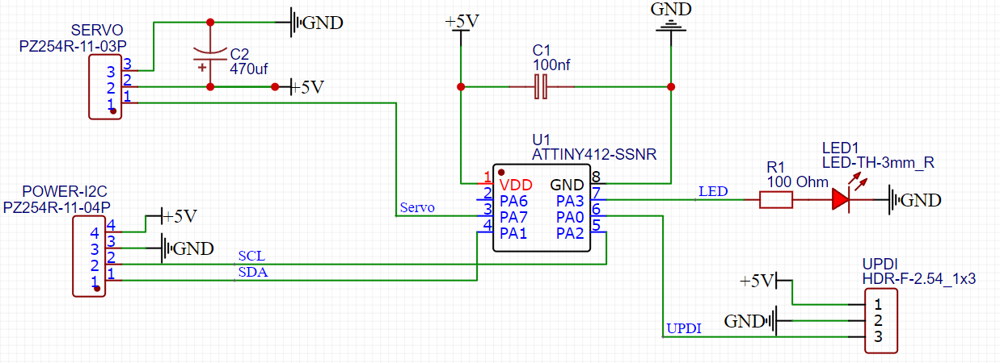
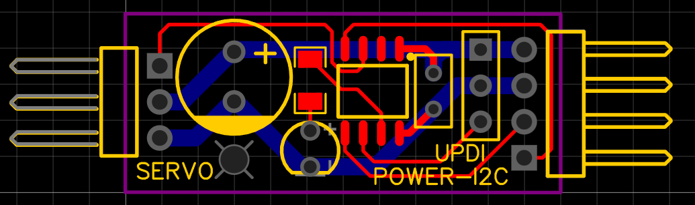

# ATtiny412 - I²C Servo Controller

Ein kompakter und konfigurierbarer I²C-Servo-Controller basierend auf einem ATtiny412. Über I²C lassen sich Position, Geschwindigkeit und andere Parameter setzen und dauerhaft im EEPROM speichern.

A minimal I²C servo controller based on the ATtiny412. Supports configurable position, speed, and pulse range. Parameters are stored in EEPROM. Optional automatic servo detach.

---
## Arduino Code
### ✨ Features

- Steuerung eines Servos per I²C
- Konfigurierbare:
  - Anfangs-/Endposition
  - Geschwindigkeit
  - Pulsweiten (Min/Max)
  - Startposition
- EEPROM-Speicherung der Einstellungen
- Detach-Option nach Bewegung des Servos
- LED als Statusanzeige
- Angepasste Servo Library um Speicher zu sparren (Nur attach / detach / write mit einem Servo möglich)
- Kompakte Umsetzung für ATtiny412
- Validierung der gespeicherten EEPROM-Werte mittels Prüfsumme (Checksum)
  - Bei ungültigen Werten: LED blinkt sehr schnell

---

### 🧪 ToDo / Ideen

- [X] **Speicherung der Pulsweiten im EEPROM**  
  Speichere die Pulsweiten für Min und Max im EEPROM, um sie nach einem Neustart wiederherzustellen.
- [x] **Detach-Funktion nach Bewegung**  
  Die Funktionalität, den Servo nach der Bewegung vom System zu trennen (Detach), sollte die Leistung optimieren und den Stromverbrauch senken.
- [x] **Befehl zum Blinken**  
  Wen aktiviert blinkt die LED. Dies erleichtert das auffinden eines Moduls.
- [x] **Werte per I²C auslesbar machen**  
  Ermögliche das Auslesen der gespeicherten Werte (z. B. Start-, Endposition, Pulsweiten, etc.) über I²C für eine benutzerfreundliche Kommunikation.
- [X] **Input-Werte validieren (constrain)**  
  Setze eine Validierung ein, die sicherstellt, dass alle Werte (z. B. Positions-, Geschwindigkeits- und Pulsweitenwerte) innerhalb eines gültigen Bereichs liegen. Eine `constrain()`-Funktion könnte hier helfen.
- [X] **Anfang ≤ Ende erzwingen**  
  Stelle sicher, dass der Startwert der Position immer kleiner oder gleich dem Endwert ist, um inkonsistente Positionen zu vermeiden.
- [X] **LED Blinken an / aus**  
  Um einen Arduino mit der Adresse zu finden die LED Blinken lassen.
- [X] **EEPROM-Datenintegrität per Checksumme prüfen**
  Prüfe alle gelesenen Werte auf Gültigkeit und verifiziere die Konsistenz per Checksumme.

---

### 📦 Hardware

- **Mikrocontroller:** ATTINY412-SSN, 8-Bit-ATtiny AVR-RISC Mikrocontroller, 4 KB, 20 MHz, SOIC-8
- **Takt:** 20 MHz
- **Versorgungsspannung:** +5 VDC
- **Programmierung:** UPDI

---

### 🔌 Pinbelegung

| Funktion      | ATtiny Pin  |  Pin        | GPIO (megaTinyCore)  |
|---------------|-------------|-------------|----------------------|
| VCC           | 1           | —           | —                    |
| Nicht genutzt | 2           | PA6         | 0                    |
| **Servo**     | 3           | PA7         | 1                    |
| **SDA**       | 4           | PA1         | 2                    |
| **SCL**       | 5           | PA2         | 3                    |
| **UPDI**      | 6           | PA0         | 5                    |
| **LED**       | 7           | PA3         | 4                    |
| GND           | 8           | —           | —                    |

[ATtiny412 Übersicht bei megaTinyCore (GitHub)](https://github.com/SpenceKonde/megaTinyCore/blob/master/megaavr/extras/ATtiny_x12.md)

---

## 🛠️ Kompilieren & Flashen (BOD, Takt, Fuse)

Das Hochladen erfolgt in drei Schritten
1. Arduino Settings & Bootloader schreiben
2. EEPROM Default Werte schreiben
3. Sketch hochladen

### 🛠️ Arduino Settings

Für den stabilen Betrieb mit 20 MHz und dem EEPROM-Erhalt:
- **Board-Bibliothek:** [megaTinyCore](https://github.com/SpenceKonde/megaTinyCore)
- **BOD Mode when Active / Sleeping:** Enabled / Enabled
- **BOD Voltage Level:** 4.2 V
- **Board:** ATtiny412/402/212/202
- **Chip:** ATtiny412
- **Clock:** 20 MHz internal
- **Save EEPROM:** EEPROM retained
- **PWM Pins:** PA1–3,7 (default)
- **Wire Library mode:** Master or Slave
- **Programmer:** SerialUPDI - SLOW: 57600 baud

Diese Einstellungen müssen über „**Burn Bootloader**“ gesetzt werden!

### 🔄 EEPROM Default Initialisierung

Zum Zurücksetzen oder Erstprogrammieren des EEPROMs kann das separate Tool verwendet werden:

🔗 https://github.com/jkarsten/ATtiny412-I2C-Servo-Controler-EEPROM-DEFAULT

### 🛠️ Upload des Sketch

Nach dem beschreiben des EEPROMs den Sketch hochladen

---

## 🛡️ EEPROM-Datenvalidierung mittels Prüfsumme
Um die Integrität der im EEPROM gespeicherten Konfigurationsdaten sicherzustellen, wird eine einfache XOR-basierte Prüfsumme verwendet. Diese Checksumme deckt alle konfigurierbaren Werte ab:
- Startposition
- Anfangs-/Endposition
- Bewegungsgeschwindigkeit
- I²C-Adresse
- Pulsweite Min/Max (jeweils 2 Byte)

Nach jeder Änderung eines dieser Werte wird automatisch die Checksumme neu berechnet und im EEPROM gespeichert.

Beim Start des Controllers werden alle Werte aus dem EEPROM geladen und gegen die gespeicherte Checksumme geprüft. Stimmen die Werte nicht überein (z. B. durch Bitfehler, Stromausfall o. ä.), gilt die Konfiguration als beschädigt.

In diesem Fall geht der Controller in einen sicheren Fehlerzustand:
🔴 Die LED beginnt schnell zu blinken und alle weiteren Funktionen werden blockiert. So lässt sich das betroffene Modul leicht erkennen.

---

### 🧰 Speichernutzung

- **Programmspeicher**: Der Sketch verwendet **3822 Bytes** (93%) des verfügbaren Programmspeichers. Der maximale Speicher beträgt **4096 Bytes**.
  
- **Dynamischer Speicher (RAM)**: Die globalen Variablen nutzen **142 Bytes** (55%) des verfügbaren dynamischen Speichers, wodurch noch **114 Bytes** für lokale Variablen übrig bleiben. Der maximale dynamische Speicher beträgt **256 Bytes**.

Dies zeigt, dass der Speicher des ATtiny412 weitgehend ausgelastet ist, insbesondere der dynamische Speicher (RAM). Weitere Funktionen sind deshalb schwer umzusetzen. Optimierungen sind möglich.

---

### 🧪 Unterstützte I²C-Befehle

**Jeder Befehl besteht aus einem oder mehreren Bytes:**

- Byte 1: `DXXX BBBB`
  - D = Detach Bit 7
  - B = Befehl (untere 4 Bit)
- Byte 2: Wert (Position, Geschwindigkeit etc.)
- Byte 3 (optional): Bei Werten >255 (für Pulsweite)

***Detach-Flag:***  
Das höchste Bit im ersten Byte (`Bit 7 = 1`) bewirkt, dass der Servo nach der Bewegung getrennt wird.

| Befehl               | Code `BBBB` | Beschreibung                           |
|----------------------|-------------|----------------------------------------|
| Gehe zu Position     | `0000`      | Setzt Servo-Zielposition               |
| Gehe zum Anfang      | `0001`      | Setzt auf gespeicherten Anfang         |
| Gehe zum Ende        | `0010`      | Setzt auf gespeichertes Ende           |
| Setze Speed          | `0100`      | Geschwindigkeit (0–100 ms Schritte)    |
| Werte abfragen       | `0110`      | Sendet aktuelle Werte als Antwort (Siehe - Werte abfragen     |
| LED Blinken          | `0111`      | LED Blinken zum Auffinden eines Moduls |
|                      |             |                                        |
| Puls Min speichern   | `1001`      | Pulsweite MIN (in µs, 2 Byte)          |
| Puls Max speichern   | `1010`      | Pulsweite MAX (in µs, 2 Byte)          |
| Anfang speichern     | `1100`      | Neue Startposition (0–180)             |
| Ende speichern       | `1101`      | Neue Endposition (0–180)               |
| Speed speichern      | `1110`      | Standard-Geschwindigkeit               |
| I²C Adresse ändern   | `1111`      | Neue Adresse speichern                 |

---

### 🔍 Werte abfragen

Die aktuellen Konfigurations- und Statuswerte des Moduls (z. B. Position, Startwert, Pulsweiten etc.) können über einen I²C-Request gelesen werden.

Dabei muss **kein spezieller Befehl vorher gesendet werden**. Der I²C-Master stellt einfach eine Leseanfrage an das Modul:

```cpp
Wire.requestFrom(Adresse, 12);
```
Das Modul antwortet automatisch mit einem 12-Byte-Datenpaket:

| Byte  |	Inhalt             |	Beschreibung                   |
|-------|--------------------|---------------------------------|
| 0     |	I²C-Adresse        |	Eigene Adresse zur Überprüfung |
| 1     |	Modul-ID           |	Immer 0x02 für Servo-Modul     |
| 2     |	Aktuelle Position  | 	Derzeitige Servoposition       |
| 3     |	Startposition      |	Startwert aus dem EEPROM       |
| 4     |	Anfang             |	Gültiger Bereich: Start        |
| 5     |	Ende               |	Gültiger Bereich: Ende         |
| 6     |	Geschwindigkeit    |	Bewegungsverzögerung (0–100 ms)|
| 7     |	Servo aktiv        |	1 = attached, 0 = detached     |
| 8–9   |	Pulsweite MIN      |	16-Bit Wert: highByte, lowByte |
| 10–11 |	Pulsweite MAX      |	16-Bit Wert: highByte, lowByte |

Hinweis: Die Reihenfolge der Bytes ist festgelegt und sollte beim Parsen im Master-Code berücksichtigt werden.

---

### 💾 EEPROM-Adressen

| Adresse | Funktion               |
|---------|------------------------|
| `0x00`  | Startposition          |
| `0x01`  | Anfangsposition        |
| `0x02`  | Endposition            |
| `0x03`  | Geschwindigkeit        |
| `0x04`  | I²C-Adresse            |
| `0x05`  | Pulsweite MIN (Word)   |
| `0x07`  | Pulsweite MAX (Word)   |
| `0x09`  | Prüfsumme (Checksum)   |
---

### ⚠️ Hinweise

- Die Pulsweiten müssen im Bereich **500 – 2500 µs** liegen.
- `ServoSpeed = 0` bewegt sofort zur Zielposition.
- Neue I²C Adressen werden sofort übernommen und im EEPROM gespeichert.
- Bei ungültigen oder fehlerhaften EEPROM-Werten wird die LED zur Fehlersignalisierung langsam ein- und ausgeblendet ("atmen").


---

### 📚 Abhängigkeiten

- [megaTinyCore](https://github.com/SpenceKonde/megaTinyCore)

## PCB
### 🔌 Schaltplan



Der Schaltplan zeigt die Pinbelegung und die Verbindung zu den Komponenten. Weitere Details zur Funktionalität findest du in der oben genannten Beschreibung.

### 🛠️ PCB Layout

Hier ist das PCB-Layout für das ATtiny412 I²C Servo Control Board:


